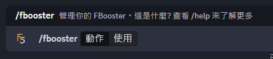

# 使用方式

欲使用 FBooster，請至 Discord  指令頻道中打上指令 `/fbooster 動作:使用`

<figure><figcaption></figcaption></figure>

接著選擇一個要使用的 FBooster

<figure><figcaption></figcaption></figure>

確認後，按下"確認"啟用

<figure><figcaption></figcaption></figure>

接著，伺服器的所有人會收到啟用通知，表示已啟用。

<figure><figcaption></figcaption></figure>
